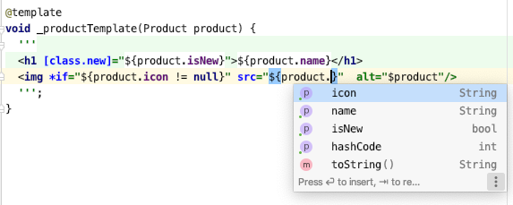

# html_template

A server-side HTML templating engine in Dart.



## Features

- Auto-completion and static analysis in the template.
- Classical control-flow constructs: `*if`, `*for`, `*switch`
- Conditionally add CSS classes (`[class.my-class]="$condition"`) and HTML attributes (`[disabled]="$condition"`)
- Automatically escapes the variables
- Syntax highlighting (in IntelliJ-based IDE)

## Examples

### Full basic example
#### Write the template code

Declare a private `void` function tagged with a `@template` attribute:

```dart
import 'example/lib/main.dart#full_example';
```

#### Generate the code

- `pub run build_runner watch --delete-conflicting-outputs`

This generates a public function with the same arguments as the original. The generated code looks like:
```dart
import 'example/lib/main_generated_example.dart#generated';
```
See the real generated code [here](example/lib/main.g.dart)

#### Use the template

Call the generated public methods to build the HTML page from your data.
```dart
import 'example/lib/main.dart#usage';
```

### Condition
```dart
import 'example/lib/condition.dart#simple';
```

### Loop
To repeat an HTML element, use the attribute: `*for="$item in $iterable"`.  

```dart
import 'example/lib/loop.dart#loop';
```

Notice that we have to define the `item` variable outside of the string literal.   
This is a bit unfortunate but string literals don't allow to define a variable inside them).

You can also write a loop with several string literals:
```dart
import 'example/lib/loop.dart#loop_alt';
```

### Switch
```dart
import 'example/lib/switch.dart#switch';
```

### CSS Classes
```dart
import 'example/lib/css_classes.dart#classes';
```

### Normal Dart code
You can use normal Dart code around the string literals to do complex things in your template.
You can have has many strings literal as you want.

```dart
import 'example/lib/multiple_literals.dart#complex';
```

### Nested template
Include another template by calling the generated function in a string interpolation:

```dart
import 'example/lib/nested.dart#nested';
```

### Others
Use `<text *if="..">xx</text>` tag if you want to output some text without the html element wrapper.
